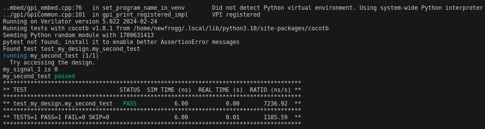
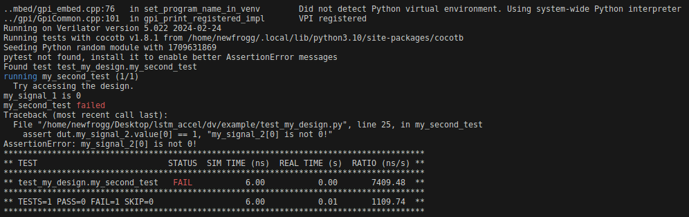

# Design Verification

## Prerequisites
- Python 3.6+ with cocotb installed
- A Verilog simulator. E.g: Verilator
- GNU make 

### cocotb
```bash
pip install cocotb
```

### Verilator
Verilator 5.006+ (cocotb supported) build from [source](https://verilator.org/guide/latest/install.html#git-quick-install) 

### Example
Follow [example](./example) folder.

#### Workflow
- Prepare design under test (E.g: my_design.sv)
- Write test vector and test script
- Adjust make to fit with your design
- Perform simulation
```sh 
make SIM=verilator
```

#### Result
***PASSED***

***FAILED***

## Reference
Simulator support: [https://docs.cocotb.org/en/stable/simulator_support.html#verilator](https://docs.cocotb.org/en/stable/simulator_support.html#verilator)

Install Verilator from source: [https://verilator.org/guide/latest/install.html#git-quick-install](https://verilator.org/guide/latest/install.html#git-quick-install)